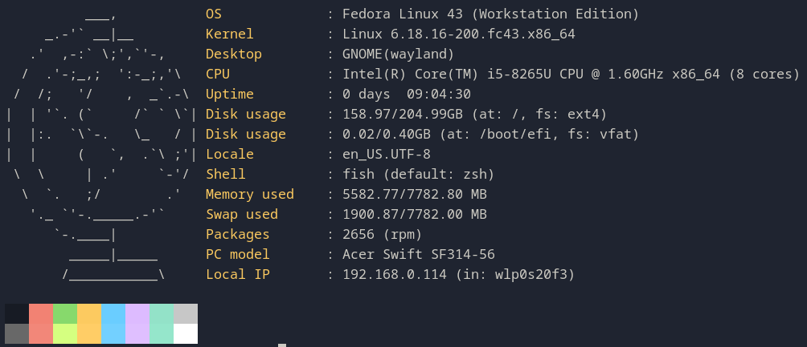
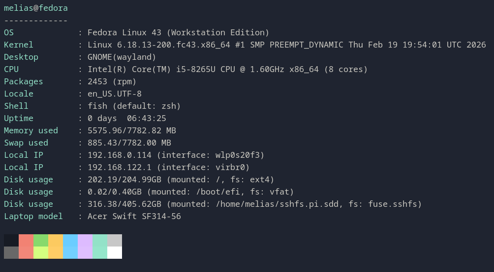

# Mefetch

This is a Neofetch-like terminal application written in C. I know a Neofetch-like application written in C already exists, called Fastfetch. This application is just a hobby project to stay in touch with C.

!!! Application development has just started, and no parts have been optimized yet.

## TODO
- [x] Show kernel
- [ ] Show current IP address
- [ ] Show used memory
- [ ] Show used disk space
- [ ] Show graphics card
  

